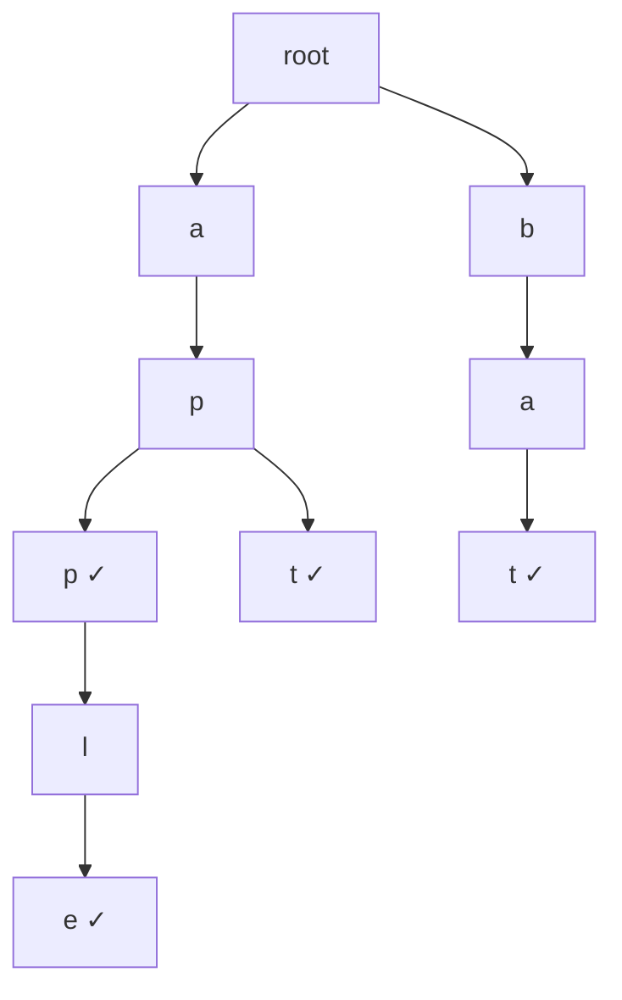

A **Trie** (pronounced "try") is a tree-like data structure used to store strings where each node represents a single character. It is also called a **Prefix Tree** because it allows efficient prefix-based searching.

Unlike Hash Maps, a Trie stores strings in a way that all strings with a common prefix share the same path from the root — making prefix queries extremely fast.

:::info When to use Trie over HashMap
Use a **Trie** when you need prefix-based search (autocomplete, spell check). Use a **HashMap** when you only need exact key lookups.
:::

---

## Structure of a Trie

Each node in a Trie contains:

- An array (or map) of children — one for each possible character
- A boolean flag `isEndOfWord` — marks if a complete word ends at this node

### Visual Example

Inserting words: `"app"`, `"apple"`, `"apt"`, `"bat"`



:::note
✓ means `isEndOfWord = true` at that node
:::

---

## Core Operations

| Operation     | Description                            | Time Complexity |
|--------------|----------------------------------------|-----------------|
| `insert`     | Insert a word into the Trie            | $O(L)$          |
| `search`     | Search if an exact word exists         | $O(L)$          |
| `startsWith` | Check if any word starts with a prefix | $O(L)$          |

Where $L$ = length of the word or prefix.

**Space Complexity:** $O(N \times L)$ where $N$ = number of words, $L$ = average word length.

---

## Step-by-Step Dry Run

**Inserting:** `"app"`, `"apple"`, `"apt"`

| Step | Operation        | Characters Traversed | isEndOfWord Set |
|------|-----------------|---------------------|-----------------|
| 1    | insert("app")   | a → p → p           | true at last p  |
| 2    | insert("apple") | a → p → p → l → e  | true at e       |
| 3    | insert("apt")   | a → p → t           | true at t       |

**Searching:** `"app"` → traverses a → p → p → found, `isEndOfWord = true` ✅

**startsWith:** `"ap"` → traverses a → p → node exists ✅

---

## Implementations

### Python

```python
class TrieNode:
    def __init__(self):
        self.children = {}
        self.is_end_of_word = False


class Trie:
    def __init__(self):
        self.root = TrieNode()

    def insert(self, word: str) -> None:
        node = self.root
        for char in word:
            if char not in node.children:
                node.children[char] = TrieNode()
            node = node.children[char]
        node.is_end_of_word = True

    def search(self, word: str) -> bool:
        node = self.root
        for char in word:
            if char not in node.children:
                return False
            node = node.children[char]
        return node.is_end_of_word

    def starts_with(self, prefix: str) -> bool:
        node = self.root
        for char in prefix:
            if char not in node.children:
                return False
            node = node.children[char]
        return True


# Example usage
trie = Trie()
trie.insert("apple")
trie.insert("app")
trie.insert("apt")

print(trie.search("apple"))      # True
print(trie.search("app"))        # True
print(trie.search("ap"))         # False
print(trie.starts_with("ap"))    # True
print(trie.starts_with("bat"))   # False
```

### Java

```java
class TrieNode {
    TrieNode[] children = new TrieNode[26];
    boolean isEndOfWord = false;
}

public class Trie {
    private final TrieNode root;

    public Trie() {
        root = new TrieNode();
    }

    public void insert(String word) {
        TrieNode node = root;
        for (char c : word.toCharArray()) {
            int index = c - 'a';
            if (node.children[index] == null) {
                node.children[index] = new TrieNode();
            }
            node = node.children[index];
        }
        node.isEndOfWord = true;
    }

    public boolean search(String word) {
        TrieNode node = root;
        for (char c : word.toCharArray()) {
            int index = c - 'a';
            if (node.children[index] == null) {
                return false;
            }
            node = node.children[index];
        }
        return node.isEndOfWord;
    }

    public boolean startsWith(String prefix) {
        TrieNode node = root;
        for (char c : prefix.toCharArray()) {
            int index = c - 'a';
            if (node.children[index] == null) {
                return false;
            }
            node = node.children[index];
        }
        return true;
    }

    public static void main(String[] args) {
        Trie trie = new Trie();
        trie.insert("apple");
        trie.insert("app");
        trie.insert("apt");

        System.out.println(trie.search("apple"));    // true
        System.out.println(trie.search("app"));      // true
        System.out.println(trie.search("ap"));       // false
        System.out.println(trie.startsWith("ap"));   // true
        System.out.println(trie.startsWith("bat"));  // false
    }
}
```

### C++

```cpp
#include <bits/stdc++.h>
using namespace std;

struct TrieNode {
    TrieNode* children[26];
    bool isEndOfWord;

    TrieNode() {
        isEndOfWord = false;
        for (int i = 0; i < 26; i++) {
            children[i] = nullptr;
        }
    }
};

class Trie {
private:
    TrieNode* root;

public:
    Trie() {
        root = new TrieNode();
    }

    void insert(const string& word) {
        TrieNode* node = root;
        for (char c : word) {
            int index = c - 'a';
            if (node->children[index] == nullptr) {
                node->children[index] = new TrieNode();
            }
            node = node->children[index];
        }
        node->isEndOfWord = true;
    }

    bool search(const string& word) {
        TrieNode* node = root;
        for (char c : word) {
            int index = c - 'a';
            if (node->children[index] == nullptr) {
                return false;
            }
            node = node->children[index];
        }
        return node->isEndOfWord;
    }

    bool startsWith(const string& prefix) {
        TrieNode* node = root;
        for (char c : prefix) {
            int index = c - 'a';
            if (node->children[index] == nullptr) {
                return false;
            }
            node = node->children[index];
        }
        return true;
    }
};

int main() {
    Trie trie;
    trie.insert("apple");
    trie.insert("app");
    trie.insert("apt");

    cout << trie.search("apple") << "\n";    // 1
    cout << trie.search("app") << "\n";      // 1
    cout << trie.search("ap") << "\n";       // 0
    cout << trie.startsWith("ap") << "\n";   // 1
    cout << trie.startsWith("bat") << "\n";  // 0

    return 0;
}
```

### JavaScript

```javascript
class TrieNode {
    constructor() {
        this.children = {};
        this.isEndOfWord = false;
    }
}

class Trie {
    constructor() {
        this.root = new TrieNode();
    }

    insert(word) {
        let node = this.root;
        for (const char of word) {
            if (!node.children[char]) {
                node.children[char] = new TrieNode();
            }
            node = node.children[char];
        }
        node.isEndOfWord = true;
    }

    search(word) {
        let node = this.root;
        for (const char of word) {
            if (!node.children[char]) {
                return false;
            }
            node = node.children[char];
        }
        return node.isEndOfWord;
    }

    startsWith(prefix) {
        let node = this.root;
        for (const char of prefix) {
            if (!node.children[char]) {
                return false;
            }
            node = node.children[char];
        }
        return true;
    }
}

// Example usage
const trie = new Trie();
trie.insert("apple");
trie.insert("app");
trie.insert("apt");

console.log(trie.search("apple"));     // true
console.log(trie.search("app"));       // true
console.log(trie.search("ap"));        // false
console.log(trie.startsWith("ap"));    // true
console.log(trie.startsWith("bat"));   // false
```

---

## Trie vs Other Data Structures

| Feature           | Trie          | HashMap        | Array/List   |
|------------------|---------------|----------------|--------------|
| Prefix search    | ✅ O(L)        | ❌ Not possible | ❌ O(N×L)    |
| Exact search     | ✅ O(L)        | ✅ O(1) avg     | ❌ O(N×L)    |
| Space efficiency | ❌ High usage  | ✅ Moderate     | ✅ Low       |
| Autocomplete     | ✅ Native      | ❌ Hard         | ❌ Very hard |
| Sorted traversal | ✅ Easy        | ❌ Hard         | ✅ Easy      |

---

## Real-World Use Cases

- **Search Autocomplete** — Google Search and browser URL bar suggest completions using Tries
- **Spell Checkers** — MS Word and Grammarly use Tries to find nearest valid words
- **IP Routing** — Routers use Tries (Patricia Trees) to match IP address prefixes
- **T9 Predictive Text** — Old mobile phones used Tries to predict words from number presses
- **Word Games** — Scrabble solvers and crossword generators use Tries for word lookup

---

## Related LeetCode Problems

| Problem | Difficulty | Link |
|---------|------------|------|
| #208 — Implement Trie (Prefix Tree) | Medium | [LeetCode](https://leetcode.com/problems/implement-trie-prefix-tree/) |
| #211 — Design Add and Search Words Data Structure | Medium | [LeetCode](https://leetcode.com/problems/design-add-and-search-words-data-structure/) |
| #212 — Word Search II | Hard | [LeetCode](https://leetcode.com/problems/word-search-ii/) |
| #648 — Replace Words | Medium | [LeetCode](https://leetcode.com/problems/replace-words/) |
| #677 — Map Sum Pairs | Medium | [LeetCode](https://leetcode.com/problems/map-sum-pairs/) |

---

## Summary

- A Trie stores strings character by character in a tree structure
- All strings with a common prefix share the same path from root
- Insert, Search, and StartsWith all run in $O(L)$ time
- Best data structure for **prefix-based** operations like autocomplete
- Use Trie when prefix queries matter; use HashMap for exact lookups only
